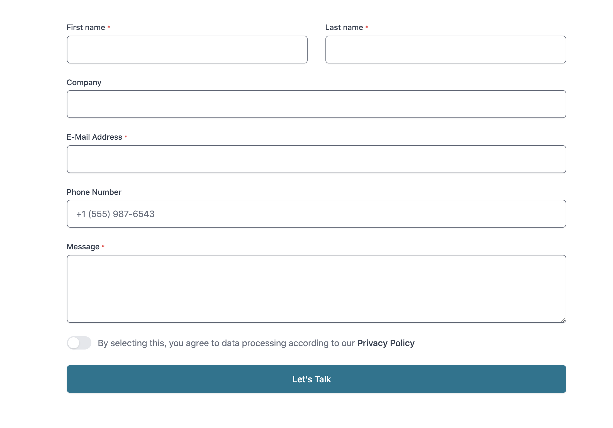

# Serverless Contact Form

Serverless Contact Form built with Serverless Framework, using AWS API Gateway & AWS Lambda.

Also an example Ajax-Form made with Tailwind CSS 2.x and AlpineJS, which passes along all the required fields to the API & Lambda.

##### Example Form



# Requirements
- Serverless Framework
- AWS SDK & Account
- AWS Simple Email Service verified with the email address you want to have contact form submissions delivered to.

#### Credentials Config
- Either via AWS-Vault (default)
- Or a Serverless CLI instance with credentials configured, [read here](https://www.serverless.com/framework/docs/providers/aws/guide/credentials/)

# AWS-Vault / Running NPM scripts
The scripts in `package.json` are adjusted to work with 99Design's [AWS-Vault](https://github.com/99designs/aws-vault).

If you don't use that in your environment, simply remove the `aws-vault exec -- $AWS_PROFILE` from each command.

# Setup:
Copy and rename `.env.example` to `.env` and fill in your details.

Run `npm install`  

Do your thing, and then `npm run deploy`.

# TailwindCSS Form
The form has no action, so that a Captcha can be integrated, otherwise form could be submitted with javascript turned off.

```html
<form x-data="contactForm()" x-init="endPoint = 'https://your-aws-endpoint.com/contact'" @submit.prevent="validateForm"
    id="contactForm" method="POST" class="grid grid-cols-1 gap-y-6 sm:grid-cols-2 sm:gap-x-8">

    <div>
        <label for="first_name" class="block text-sm font-medium leading-5 text-gray-700">
            First Name
            <small class="text-red-500">*</small>
        </label>
        <div class="mt-1 relative rounded-md shadow-sm">
            <input required name="first_name" x-model="formData.first_name" type="text" id="first_name"
                class="py-3 px-4 block w-full rounded-md transition focus:ring-cyan-500 focus:border-cyan-500">
        </div>
    </div>

    <div>
        <label for="last_name" class="block text-sm font-medium leading-5 text-gray-700">
            Last Name
            <small class="text-red-500">*</small>
        </label>
        <div class="mt-1 relative rounded-md shadow-sm">
            <input required name="last_name" x-model="formData.last_name" type="text" id="last_name"
                class="py-3 px-4 block w-full rounded-md transition focus:ring-cyan-500 focus:border-cyan-500">
        </div>
    </div>

    <div class="sm:col-span-2">
        <label for="company" class="block text-sm font-medium leading-5 text-gray-700">
            Company
        </label>
        <div class="mt-1 relative rounded-md shadow-sm">
            <input name="company" x-model="formData.company" type="text" id="company"
                class="py-3 px-4 block w-full rounded-md transition focus:ring-cyan-500 focus:border-cyan-500">
        </div>
    </div>

    <div class="sm:col-span-2">
        <label for="email" class="block text-sm font-medium leading-5 text-gray-700">
            Email
            <small class="text-red-500">*</small>
        </label>
        <div class="mt-1 relative rounded-md shadow-sm">
            <input required name="email" type="email" id="email" x-model="formData.email"
                class="py-3 px-4 block w-full rounded-md transition focus:ring-cyan-500 focus:border-cyan-500">
        </div>
    </div>

    <div class="sm:col-span-2">
        <label for="phone" class="block text-sm font-medium text-gray-700">
            Phone #
        </label>
        <div class="mt-1 relative rounded-md shadow-sm">
            <input type="tel" name="phone" id="phone" x-model="formData.phone"
                class="py-3 px-4 block w-full rounded-md transition focus:ring-cyan-500 focus:border-cyan-500"
                placeholder="+1 (555) 987-6543">
        </div>
    </div>

    <div class="sm:col-span-2">
        <label for="message" class="block text-sm font-medium leading-5 text-gray-700">
            Message
            <small class="text-red-500">*</small>
        </label>
        <div class="mt-1 relative rounded-md shadow-sm">
            <textarea required name="message" x-model="formData.message" id="message" rows="4"
                class="py-3 px-4 block w-full rounded-md transition focus:ring-cyan-500 focus:border-cyan-500"></textarea>
        </div>
    </div>

    <div class="sm:col-span-2">
        <div class="flex items-start">
            <div class="flex-shrink-0">
                <span id="accept" role="checkbox" tabindex="0" x-on:click="on = !on" @keydown.space.prevent="on = !on"
                    :aria-checked="on.toString()" aria-checked="false" x-data="{ on: false }"
                    x-description="Simple toggle" x-bind:class="{ 'bg-gray-200': !on, 'bg-cyan-500': on }"
                    class="bg-gray-200 relative inline-flex flex-shrink-0 h-6 w-11 border-2 border-transparent rounded-full cursor-pointer transition-colors focus:outline-none focus:ring-2 focus:ring-offset-2 focus:ring-cyan-500">
                    <span aria-hidden="true" x-bind:class="{ 'translate-x-5': on, 'translate-x-0': !on }"
                        class="translate-x-0 inline-block h-5 w-5 rounded-full bg-white shadow transform ring-0 transition"></span>
                </span>
            </div>
            <div class="ml-3">
                <p class="text-base leading-6 text-gray-500">
                    I solemnly swear under oath, to love and uphold your
                    <a href="#" class="font-medium text-gray-700 underline">
                        Privacy Policy
                    </a>
                </p>
            </div>
        </div>
    </div>

    <div class="sm:col-span-2 w-full inline-flex rounded-md shadow-sm">
        <button :disabled="loading" type="submit"
            class="w-full inline-flex items-center justify-center px-6 py-3 border border-transparent rounded-md shadow-sm text-base font-medium text-white bg-cyan-600 hover:bg-cyan-700 focus:outline-none focus:ring-2 focus:ring-offset-2 focus:ring-cyan-500 transition">

            <span class="pr-4">
                Let's Talk
            </span>

            <svg x-cloak x-show="loading" class="animate-spin -ml-1 mr-3 h-5 w-5 text-white"
                xmlns="http://www.w3.org/2000/svg" fill="none" viewBox="0 0 24 24">
                <circle class="opacity-25" cx="12" cy="12" r="10" stroke="currentColor" stroke-width="4">
                </circle>
                <path class="opacity-75" fill="currentColor"
                    d="M4 12a8 8 0 018-8V0C5.373 0 0 5.373 0 12h4zm2 5.291A7.962 7.962 0 014 12H0c0 3.042 1.135 5.824 3 7.938l3-2.647z">
                </path>
            </svg>

        </button>
    </div>

    <div class="flex justify-center sm:col-span-2">
        <span x-cloak x-show="submitted" x-text="notification"
            x-bind:class="{ 'bg-red-100 text-red-800': failure, 'bg-green-100 text-green-800': !failure, 'px-2.5 py-0.5': submitted }"
            class="inline-flex items-center rounded-md text-sm font-medium">
        </span>
    </div>

    <!-- Honeypot -->
    <div style="opacity: 0;position: absolute;top: 0;left: 0;height: 0;width: 0;z-index: -1;">
        <input type="input" name="vip_field" value="" tabindex="-1" autocomplete="off">
    </div>

</form>

<script src="https://cdn.jsdelivr.net/gh/alpinejs/alpine@v2.x.x/dist/alpine.min.js" defer></script>
<script src="./contact.js"></script>
```

# AlpineJS Form Script
```javascript
# ./contact.js
import "whatwg-fetch";

window.contactForm = () => {

    return {
        endPoint: '',
        notification: '',
        failure: false,
        loading: false,
        submitted: false,
        formData: {
            first_name: '',
            last_name: '',
            company: '',
            email: '',
            phone: '',
            message: '',
            domain: window.location.hostname
        },

        validateForm() {
            if (this.formIsValid()) this.submitForm()
        },

        formIsValid() {
            const accepted = document.getElementById('accept')

            if (accepted.getAttribute('aria-checked') !== "true") {
                alert("To submit the form, you must read & agree to our Privacy Policy.");
                accepted.focus();
                return false;
            }

            return true;
        },

        submitForm() {
            this.loading = true;

            window.fetch(this.endPoint, {
                method: 'POST',
                headers: { 'Content-Type': 'application/json' },
                body: JSON.stringify(this.formData)
            })
                .then(this.handleErrors)
                .then(response => {
                    console.log("ok")

                    this.notification = 'Your message was forwarded, we will get back to you as soon as possible.'
                })
                .catch(error => {
                    console.log(error)

                    this.failure = true
                    this.notification = error.message
                })
                .finally(() => {
                    this.loading = false;
                    this.submitted = true
                })
        },

        handleErrors(response) {
            if (response.status !== 200) {
                throw Error('Something went awfully wrong, please wait a moment and try again.');
            }

            return response;
        }
    }
}
```

# NPM Scripts

| Command            | Action                                                    |
| ------------------ | --------------------------------------------------------- |
| deploy             | Deploy serverless architecture / update stack & services  |
| deploy-contact     | Deploy only the contact function code again               |
| invoke             | Invokes function from production                          |
| logs               | Prints production logs                                    |
| metrics            | Prints usage metrics of the past 24 hours                 |
| service-info       | Prints Static Site Mailer Serice Information              |
| test               | Runs all the tests                                        |
| test:invoke-local  | Invokes function from local with `tests/data.json`        |
| test-honeypot      | Test if Honeypot returns empty/no response                |
| serverless         | Shortcut for local Serverless CLI package                 |
| sls                | Shortcut for local Serverless CLI package                 |


# Credits & Inspiration
[Brian Holt](https://github.com/bholtbholt/static-site-mailer)